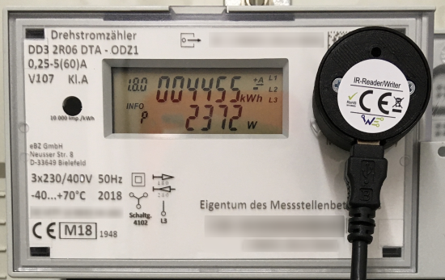
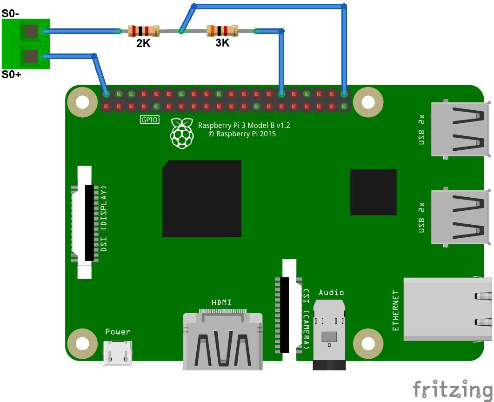

# smartmeter
This application reads out the current values of the two energy meters installed in my house. It is based on the [raspend](https://github.com/jobe3774/raspend) python library and runs on my Raspberry Pi 3 Model B+.

## Inputs
### D0 Interface

The first smart meter is a eBZ DD3 installed by my local energy provider. The DD3 is a 2-directional meter that counts both the imported power and the exported power of my PV system. It comes with a D0 interface pushing data every second. This optical data interface is a unidirectional communication interface using infrared light. The data is read via an infrared read-write head which is attached to the so called *Info-DSS* of the smart meter. 
The other end is plugged into one of my RPi's USB ports. 
My DD3's data is ASCII and is specified by *DIN EN 625056-21* ([OBIS](https://de.wikipedia.org/wiki/OBIS-Kennzahlen), MODE-D (IEC 1107)).



### S0 Interface

The second smart meter is used to measure the power consumption of my heatpump. It is a Finder Series 7E smart meter, which comes with a [S0 interface](https://de.wikipedia.org/wiki/S0-Schnittstelle) specified by *DIN 43864*. I connected **S0+** of the smart meter to one of the RPi's 5V+ GPIO pins and **S0-** is connected to another GPIO pin configured as an input pin. Since the minimum voltage for the S0 interface of this smart meter is 5V I had to use a voltage divider. I used one 2K and one 3K Ohm resistor to implement it, so the GPIO pin has a maximum voltage of 3V. The smart meter outputs 1000 pulses per kWh on the interface. These pulses are detected as rising edges on the GPIO pin and counted.



## Installation

Download or clone this repository, go to its local folder and type:
```
$ pip3 install -r requirements.txt
```
This will install all necessary dependencies.

## Usage

To run it, type:
```
$ python3 smartmeter.py --port=<port> --serialPort=<device> --s0Pin=<GPIO-pin>
```
Parameter | Description 
----------|--------
--port | Port number the server should listen on
--serialPort | Path to the serial port to use for reading the D0 interface
--s0Pin | The GPIO input pin used for counting S0 interface pulses **(optional)**

Example:
```
$ python3 smartmeter.py --port=8080 --serialPort=/dev/ttyUSB0 --s0Pin=21
```
To quit the application, press *Ctrl+C*.

## Output

After starting the script, open your favourite browser and type:
```
http://<IP-of-your-RPi>:8080/data
```
You'll get a JSON response like this:

``` json
{
   "smartmeter_d0": {
      "CURRENT_POWER_L3": {
         "OBIS_Code": "76.7.0",
         "unit": "W",
         "value": 811.78
      },
      "timestampUTC": "2020-02-06T21:37:51.607046+00:00",
      "CURRENT_POWER_L2": {
         "OBIS_Code": "56.7.0",
         "unit": "W",
         "value": 960.38
      },
      "POWER_IMPORT": {
         "OBIS_Code": "1.8.0",
         "unit": "kWh",
         "value": 4457.153
      },
      "CURRENT_POWER_L1": {
         "OBIS_Code": "36.7.0",
         "unit": "W",
         "value": 619.06
      },
      "POWER_EXPORT": {
         "OBIS_Code": "2.8.0",
         "unit": "kWh",
         "value": 4541.967
      },
      "CURRENT_POWER_SUM": {
         "OBIS_Code": "16.7.0",
         "unit": "W",
         "value": 2391.22
      }
   },
   "smartmeter_s0": {
      "count": 13756.570000000247,
      "timestampUTC": "2020-02-06T21:37:53.330171+00:00"
  }
}

```

## License

MIT. See LICENSE file.